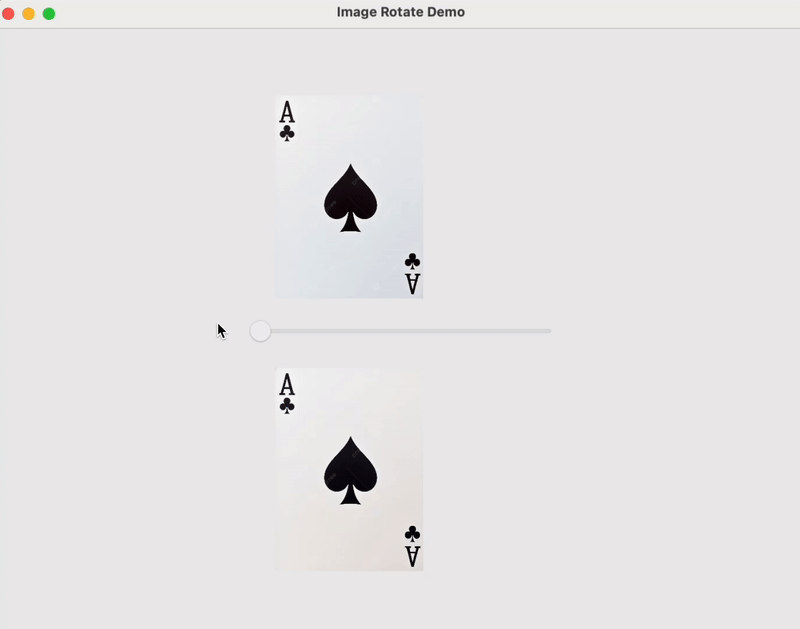

# Image Rotate Demo with Qt, QML, and OpenCV

## Demo



This project demonstrates how to rotate an image using OpenCV in a C++ backend, with a QML frontend UI built using Qt Quick.  
The app loads an image, lets you select a rotation angle with a slider, and shows the rotated image in real-time.

> **⚠️ Work In Progress**  
> This application is currently under active development.  
> Planned improvements include a more advanced GUI, additional image processing features beyond rotation, passing the input image using commandline instead of hardcoding and better performance optimizations.

---

## Features

- Load an image from local disk
- Rotate the image by any angle (0-360°) using OpenCV
- QML GUI with slider to control the rotation angle
- Display both original and rotated images
- Image data passed between QML and C++ using `QImage` and base64 encoding

---

## Technologies

- C++ (Qt 5 or Qt 6)
- QML (Qt Quick Controls 2)
- OpenCV (image processing)
- CMake build system

---

## Setup

### Prerequisites

- Qt 5.x or Qt 6.x installed (including Qt Quick modules)
- OpenCV installed (with development headers)
- CMake installed

### Build Instructions

```bash
mkdir build
cd build
cmake ..
make
./MyApp

Usage

    The application window shows the original image on top.

    Use the slider to select a rotation angle.

    The rotated image updates instantly at the bottom.

Notes

    The original image path is hardcoded in Main.qml. Change the path if you want to load a different image.

    grabToImage() function requires the window to be visible before capturing the image.

    The rotated image is passed back from C++ as a base64 PNG URI for QML image display.

License

MIT License


